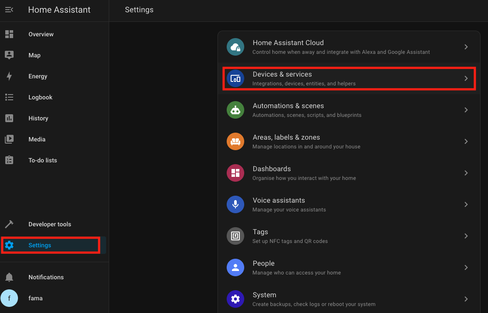
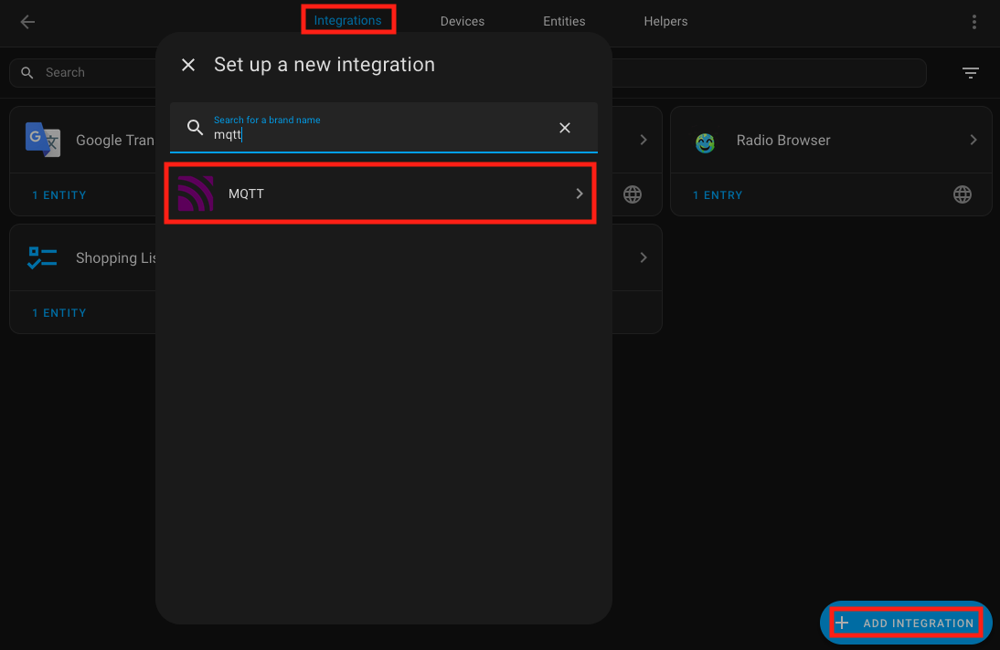
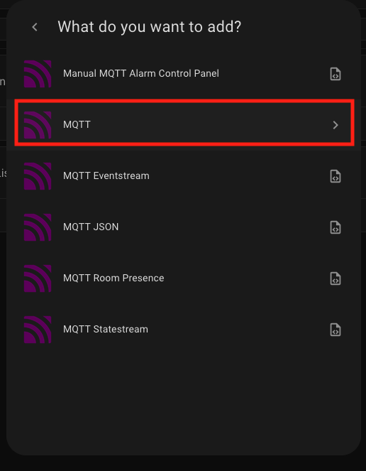
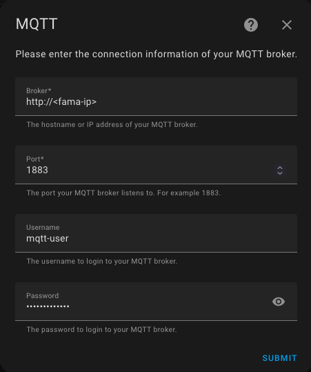
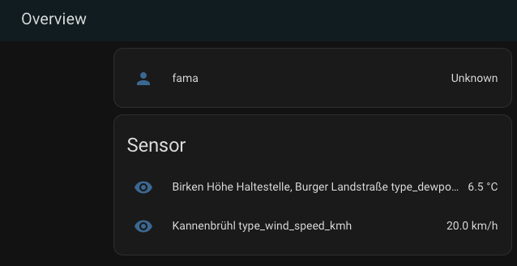

# Home Assistant  

This guide explains how to integrate the Fama application with Home Assistant using MQTT for seamless weather sensor data integration.

## Prerequisites  

Ensure you have a running instance of Home Assistant to integrate weather sensor data from the Fama application.

Ensure Home Assistant is updated to the latest version for compatibility with MQTT integration. 

You can find the official Home Assistant documentation at the following link:  
[Home Assistant Documentation](https://www.home-assistant.io/docs/)  

This site contains detailed guides, tutorials, and information about installation, configuration, and integrations.  

## MQTT Configuration  

### Access Home Assistant  

After completing the installation of Home Assistant, access its web interface at:
```
http://<home-assistant-ip>:8123/
```  
If you are running Home Assistant locally, you can open it via [http://localhost:8123](http://localhost:8123).  

### Set Up MQTT Integration in Home Assistant

1. Navigate to **Settings > Devices & Services > Add Integration**.

<p>
  
</p>

2. Search for **MQTT** and select it.  

<p>
  
</p>
<p>
  
</p>

3. Configure the MQTT broker:  
   - **Broker Hostname/IP:** Enter the hostname or IP address of the Fama application's MQTT broker.  
   - **Port:** Set the port to `1883`.  
   - **Username:** Enter the username for the MQTT broker.  
   - **Password:** Enter the corresponding password.

   Ensure the username and password match the credentials configured in the Fama application's MQTT settings.

<p>
  
</p>

4. Click **Submit** to save the settings.

  Note: Ensure that MQTT discovery is enabled in Home Assistant. This allows Fama's sensor data to be automatically detected and displayed.

## Conclusion  

Ensure that the Fama application is configured correctly to send MQTT messages. The MQTT username and password are required to connect to Fama via MQTT. Once the Fama application receives messages via the RabbitMQ, it send message via MQTT. You can verify the integration by navigating to the Devices or Entities section in Home Assistant. Weather sensor data should appear as newly discovered devices or entities..

<p>
  
</p>

## Troubleshooting

If you do not see sensors in your Home Assistant dashboard:

  - Verify the MQTT broker connection settings.
  - Ensure the Fama application is configured correctly to send MQTT messages.
  - Check the Home Assistant logs for any errors related to MQTT integration.