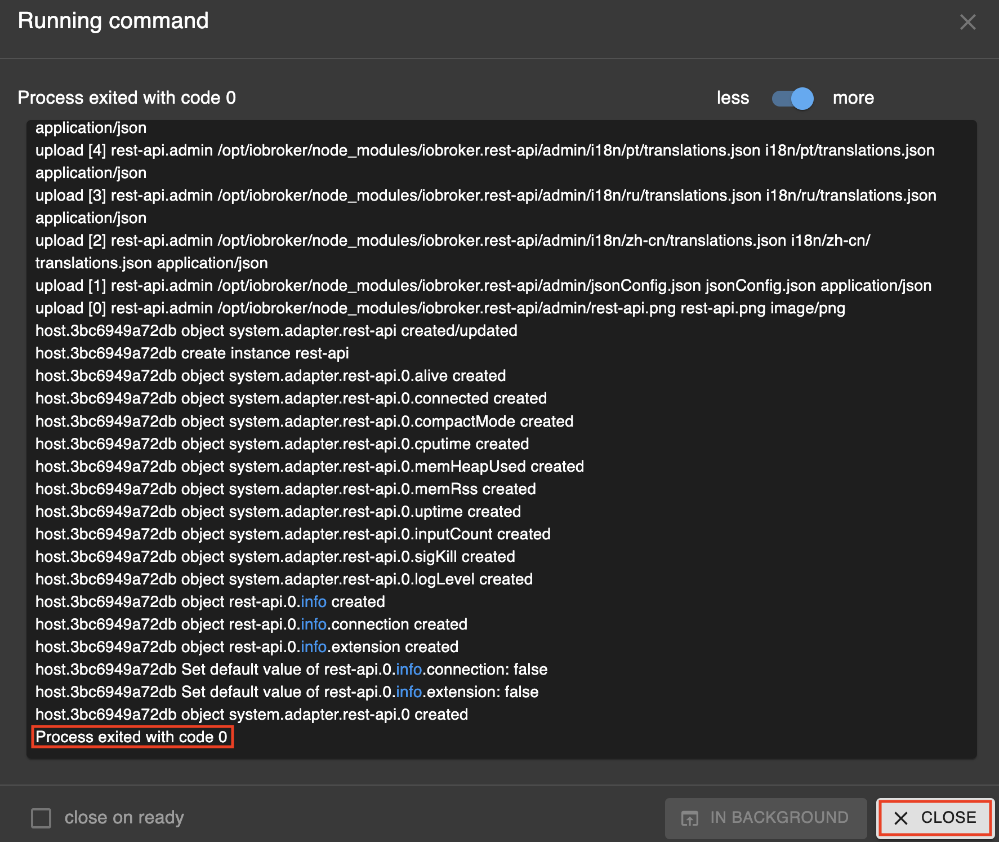

# ioBroker

This guide explains how to integrate the Fama application with ioBroker using the REST API adapter for weather sensor data processing.

## Prerequisites

Ensure you have ioBroker installed and running on your system before starting this guide.

Make sure ioBroker is updated to the latest version to ensure compatibility with the Fama application.

You can find the official ioBroker documentation at the following link:
[ioBroker Documentation](https://www.iobroker.net/#en/documentation/README.md)

This site contains detailed guides, tutorials, and information about adapters, installation, and configuration.

## Adapters

After installation, access the ioBroker web interface at:

```
http://<iobroker-ip>:8081/
```

If you run ioBroker locally, you can open it via [http://localhost:8081]().

The REST API adapter allows ioBroker to receive data from external applications, such as Fama, via API requests.

1. Navigate to the **"Adapters"** tab.
2. Search for the **"REST API"** adapter.

<p>
  
</p>

3. Install the adapter:
    - Click on the triple dots button.
    - Select the **"Add instance"** button (bottom left).

    <p>
    
    </p>

    - Wait for the installation process to complete.

    <p>
    
    </p>


Once installed, you will see the **"rest-api"** entry under the **"Instances"** tab.

## Conclusion

Verify that the Fama application is configured to send data to the ioBroker REST API endpoint. The API URL for ioBroker is required to send messages. By default, it will look like this:
```
http://<iobroker-ip>:8093/v1/
```

To improve usability, configure the **"Objects"** view in ioBroker to display custom names. Click the 'Configure' button and follow the steps below.

<p>
  
</p>

Disable the **"Auto"** option to allow custom columns and enable the **"Name"** column, making it easier to identify objects.

<p>
  
</p>


Once the Fama application is running and messages are being sent, you can view them in the **"Objects"** tab of the ioBroker web interface.

<p>
  
</p>

## Troubleshooting

If you do not see any data in the Objects tab:

- Confirm that the Fama application is running and sending data to the correct API endpoint.
- Check the ioBroker logs for any errors related to the REST API adapter.
- Ensure that the REST API adapter instance is active and configured properly.