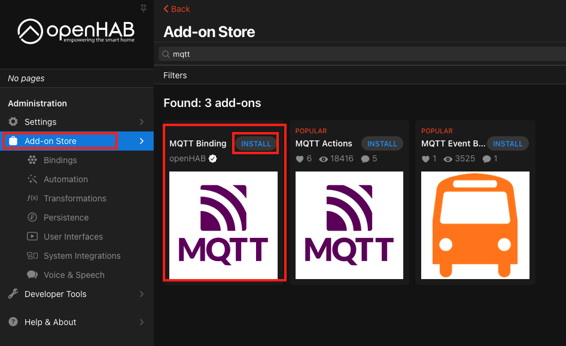
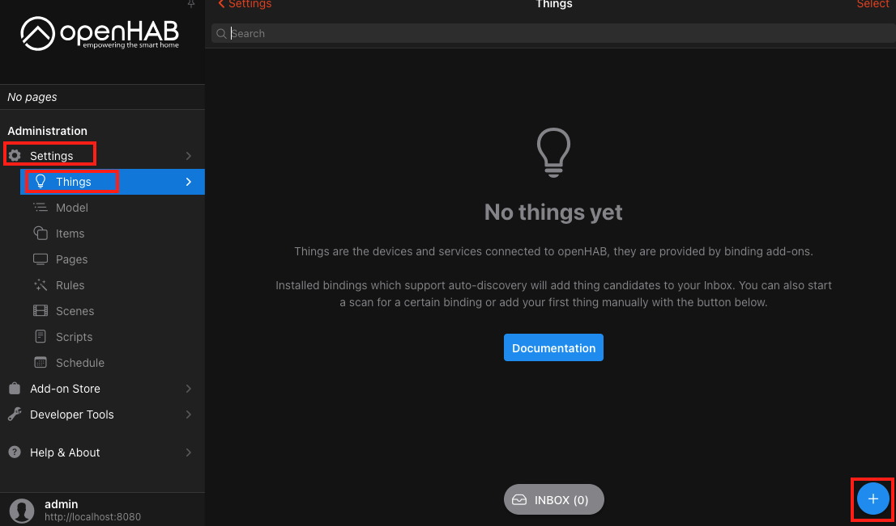
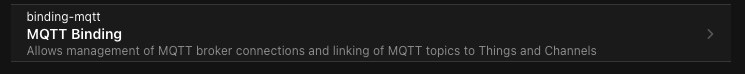
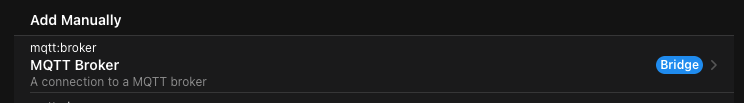
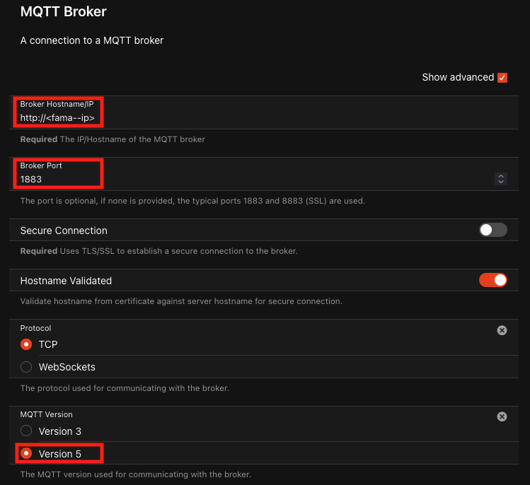
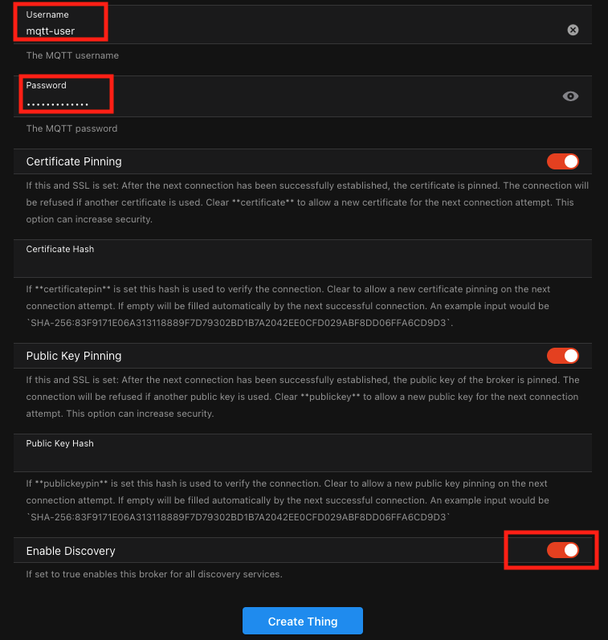
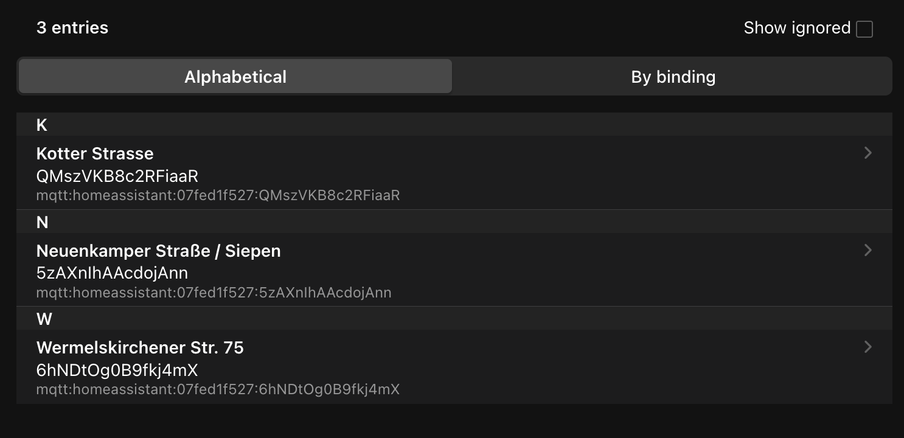
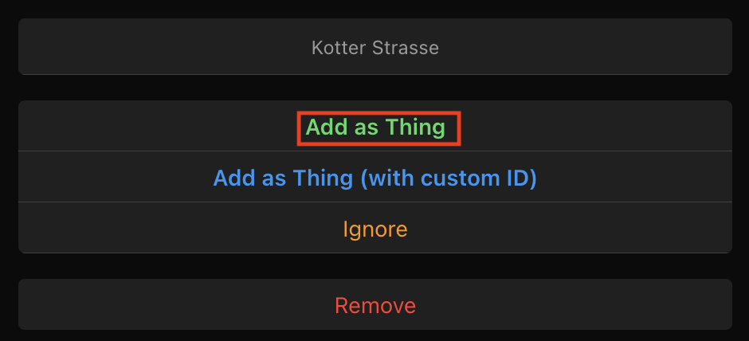
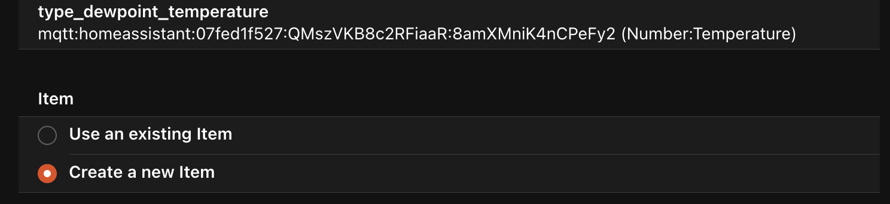
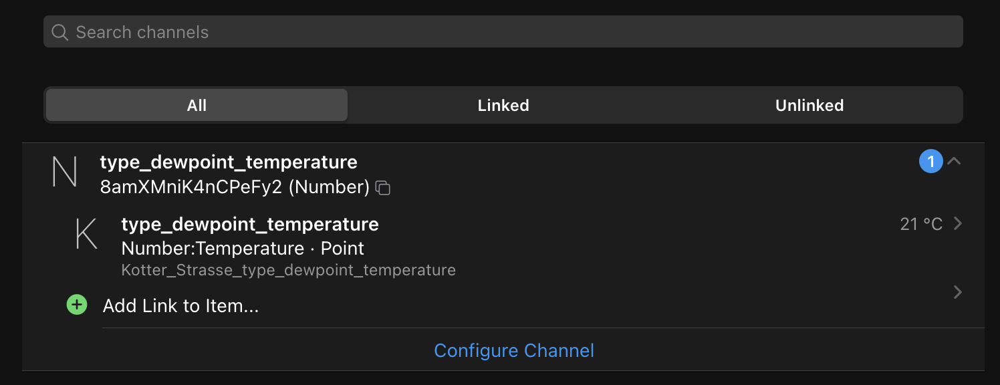

# OpenHAB

This guide explains how to connect the Fama application to OpenHAB via MQTT for weather sensor data integration.

## Prerequisite

Ensure you have OpenHAB installed and running on your system before starting this guide.

Make sure OpenHAB is updated to the latest version for compatibility with the Fama application.

You can find the official OpenHAB documentation at the following link:
[OpenHAB Documentation](https://www.openhab.org/docs/)

This site contains detailed guides, tutorials, and information about adapters, installation, and configuration.

## Setting Up Fama with Docker

Fama can be deployed using Docker, either with a simple `docker run` command or using `docker-compose` for more complex setups.

### Prerequisites
Before running Fama, ensure you have the following installed:
- Docker ([Installation Guide](https://docs.docker.com/get-docker/))
- Docker Compose (if using `docker-compose.yml` setup)
- A home automation system (Home Assistant, OpenHAB, or ioBroker)

## Running Fama with `docker run`
You can start Fama with a single `docker run` command, passing the required environment variables:

```sh
docker run -d --name fama \
  -e SMART_HOME_TYPE=HA \
  -e MQTT_USERNAME=my_mqtt_user \
  -e MQTT_PASSWORD=my_mqtt_password \
  devopsnedeco/fama
```

## Running Fama with Docker Compose
For more flexibility, you can use a `docker-compose.yml` file:

```yaml
services:
  fama:
    image: devopsnedeco/fama
    container_name: fama
    restart: unless-stopped
    ports:
      - 1883:1883
    environment:
      SMART_HOME_TYPE: "HA"
      MQTT_USERNAME: "my_mqtt_user"
      MQTT_PASSWORD: "my_mqtt_password"
```

To start Fama using Docker Compose, run:
```sh
docker-compose up -d
```

## Environment Variables
Fama requires several environment variables to function correctly. Below is a list of the key variables:

| Variable | Description |
|----------|-------------|
| `SMART_HOME_TYPE` | Type of home automation system (`HA` for Home Assistant/OpenHAB) |
| `MQTT_URL` | Optinal External MQTT broker URL (required for Home Assistant/OpenHAB integration) |
| `MQTT_USERNAME` | MQTT broker username (required for Home Assistant/OpenHAB integration) |
| `MQTT_PASSWORD` | MQTT broker password (required for Home Assistant/OpenHAB integration) |

## Verifying the Setup
Once Fama is running, you can verify its status using:
```sh
docker ps
```
This should display a running container named `fama`.

To check logs for troubleshooting:
```sh
docker logs -f fama
```

## Connect to Fama

### Access OpenHAB  

After installation, access the OpenHAB web interface at:  
```
http://<openhab-ip>:8080/
```  
If you are running OpenHAB locally, you can open it via [http://localhost:8080](http://localhost:8080).  

### Install the MQTT Binding  

1. Navigate to **Settings > Add-on Store**.  
2. Search for **MQTT Binding** in the list.  
3. Click **Install** to add the binding to your OpenHAB instance.  
<p>
  
</p>

After installation, ensure that the MQTT Binding appears under the list of installed bindings in the **Add-on** Store.

### Add the MQTT Broker  

1. Navigate to **Settings > Things**.  


2. Click the **"+"** button to add a new Thing.  

<p>
  
</p>

3. Select **MQTT Binding** from the list. 

<p>
  
</p>

4. Choose **MQTT Broker (Bridge)**.  

<p>
  
</p>

5. Configure the MQTT broker settings:  
   - **Broker Hostname/IP:** Enter the hostname or IP address of the Fama application's MQTT broker.  
   - **Port:** Set the port to `1883`. 
   - **MQTT Version:** Ensure it is set to **MQTT Version 5**.  

<p>
  
</p>

   - **Username:** Enter the username for the MQTT broker.  
   - **Password:** Enter the corresponding password.  

Ensure the username and password match the credentials configured in the Fama application's MQTT settings.

   - **Discovery:** Ensure Discovery is turned on.

<p>
  
</p>
   
6. Save the configuration.  

Once saved, the broker Thing should show **Online** if the connection is successful.  

### Adding a Station  

1. Go to **Settings > Inbox**.  
2. Click **Search for Things** and select the **MQTT Binding**.  

<p>
  
</p>

3. The stations published by Fama should appear as new Things in the Inbox.  

<p>
  
</p>

4. Click the station you want to add and select **Add as Thing**.

<p>
  
</p>

5. Assign a name and location to the station if desired, then save it.

### Creating Items from Channels  

1. Navigate to **Settings > Things** and select the station Thing you just added. 
2. Click on one of the **Channels** (e.g., a sensor).  
3. Click **Link Channel** to create a new Item.  

<p>
  
</p>

4. Configure the Item:  
   - Assign a name, label, and category.  
   - Select a group if applicable.  
5. Save the Item.  

## Conclusion

Ensure that the Fama application is configured correctly. The MQTT username and password is required to send connect to Fama via MQTT.

The sensor's data will now be available as an Item in your OpenHAB system. You can use these Items in rules, dashboards, or automations to monitor and control your devices.

<p>
  
</p>